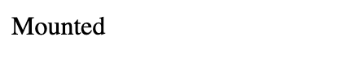
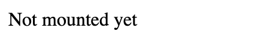

# Bug NextJS Loading component

How to reproduce:

```
npm run dev
```

Click on the "Go to feed" button.


See the loader displaying "Mounted" (expected behavior). Page will resolve 10s later with a "Home" button.



Reload the page. See the wrong text displayed.


